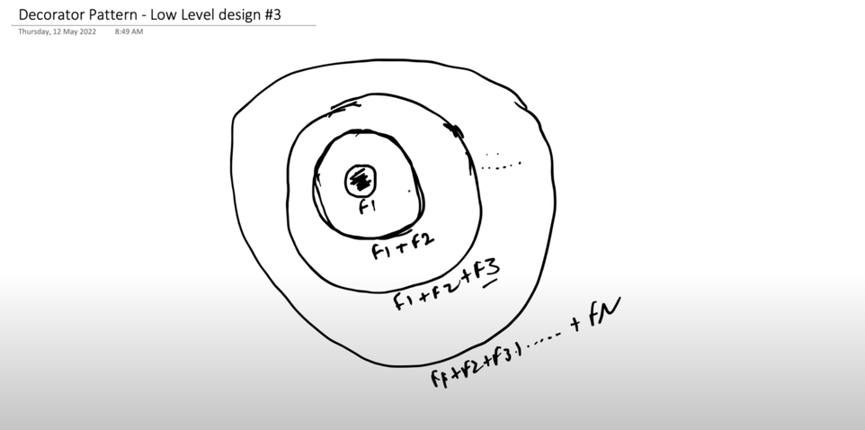
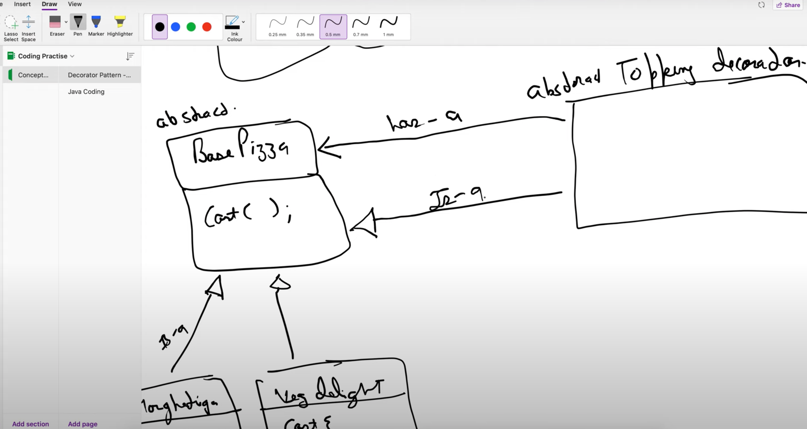
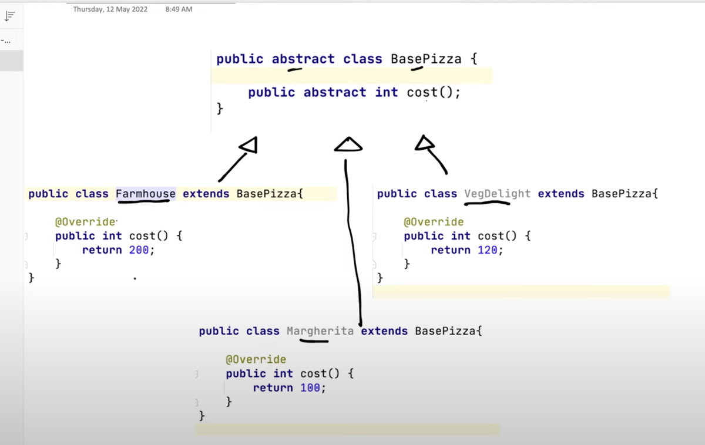
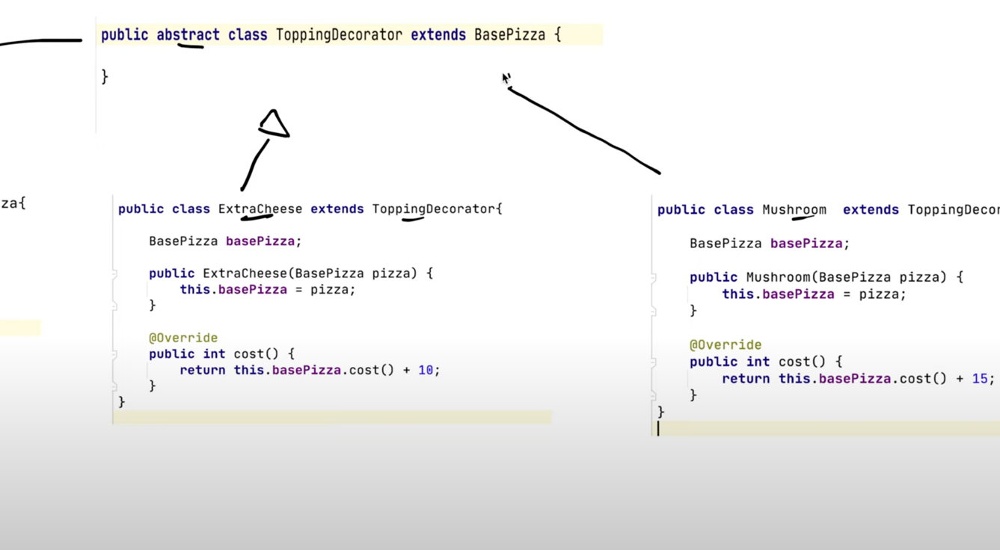
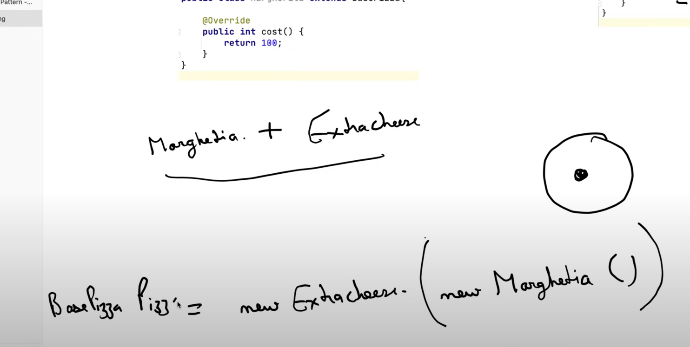

Add features on top of a base object in the form of layers 

Use case 

Pizza Shop has a Base Pizza
Toppings can be added on Base Pizza (Jalapeno,Mushroom,Cheese,Veggies)

Similarly, for Base Coffee (Cream,Espresso,Extra Milk,Soy Milk)

Decorator Pattern Prevents Class Explosion 

Abstract Class Base Pizza, With Cost as Variable

Margherita and Veg Delight are Base Pizzas (is-a) Relationship 

Decorator has has-a and is-a relationship with base class

Topping Decorator 

